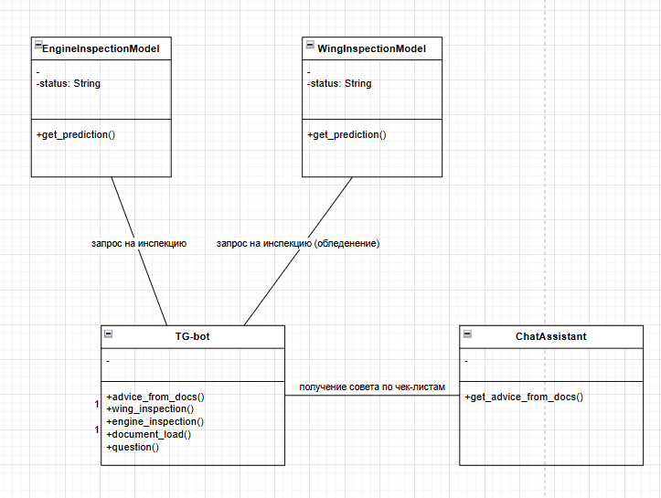
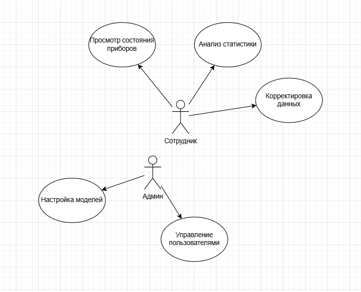

# Аналитические артефакты и описание проекта

**Порядок описания аналитических артефактов:**
1) Основные объекты продукта

> Диаграмма классов.
>   

2) Ролевая модель

| Роль          | Функции                                              | Ограничения                                            | Назначение ролей                |
|---------------|------------------------------------------------------|--------------------------------------------------------|---------------------------------|
| Сотрудник     | Просмотр состояния агрегатов, анализ документов      | Может просматривать и редактировать записи о состоянии | Через корпоративную авторизацию | 
| Администратор | Настройка ML-моделей, управление учётками сотрудников | Нет                                                    | Через корпоративную авторизацию |

3) Пользовательские/Функциональные/Нефункциональные требования

### Функциональные требования
Интеграция ML-моделей для инспекции состояния приборов и обледенения поверхностей крыльев.

Сервис должен быть реализован через ТГ-бота, но в идеале - через ios-приложение.

Веб-интерфейс для сотрудников (ground crew и пилоты).

### Пользовательские требования

>   

### Прототипы интерфейса

>   

### Перспективы расширения системы

Очень важна качественная реализация ML-моделей для анализа состояния агрегатов и обледенения поверхностей крыла. По-хорошему нужно собрать много данных и нормально обучить модели.
Помимо этого, нужно "скормить" LLM'ке все чек-листы и документы, чтобы она нормально могла работать с ними и давать советы. Еще очень хотелось бы сделать это в виде ios приложения с классным корпоративным дизайном S7, для удобства.

